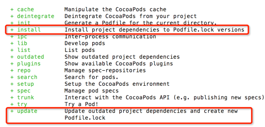
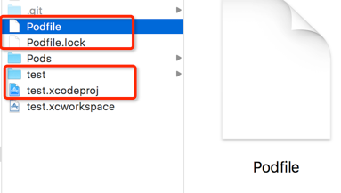

# 使用框架的人需要做

## CocoaPods 相关操作

### 查看第三方框架仓库源

```bash
pod repo
```

### 移除仓库源

```bash
pod repo remove master
```

### 添加仓库源

```bash
pod repo add master http://git.oschina.net/akuandev/Specs.git
```

### 初始化(下载服务器中所有第三方框架信息, 缓存到电脑本地)

```bash
pod setup
```

## 使用cocoapods

### 检索第三方框架

```bash
pod search 框架关键字
```
	
* 内部做的事情:
	* 从本地缓存的"第三方框架描述信息" 生成的检索文件中检索到 相关框架的信息
* 常见问题:
	* 
* 解决方案:
	* 删除cocoapods索引文件
	
		```bash
		rm ~/Library/Caches/CocoaPods/search_index.json
		```

### 安装第三方框架

#### 创建 Podfile 文件, 到自己工程内(一级目录)

* `Podfile` 文件作用?
* 答: 其实就是使用ruby语法编写的 "框架依赖描述文件"; 就是告诉 CocoaPods 需要下载集成哪些框架
* 常见配置语法
	* [http://www.jianshu.com/p/8af475c4f717](http://www.jianshu.com/p/8af475c4f717)
* 须知: 可以存放到其他目录, 但必须指定项目工程的位置
	* `xcodeproj`
	* 
* 创建命令
	
	```bash
	pod init
	```

#### 安装框架

```bash
pod install
```
	
##### 内部做的事情

* CocoaPods 如果是 1.0.1 版本
	* 直接就是根据 `Podfile` 文件找到, 框架信息, 然后下载集成
* 如果是之前版本
	* 更新本地框架信息源信息
		* 非常耗时
		* 添加参数
			* `--no-repo-update`
	* 直接就是根据 Podfile 文件找到, 框架信息, 然后下载集成

##### 常见错误

* 
* 原因: 
	* `Podfile` 文件就是描述 Xcode 工程中的 `targets`
		* 如果在老版本没有指明, CocoaPods 会创建一个名称为 `default` 的隐式 `target`，会和我们工程中的第一个 `target` 相对应。
		* 在 1.0.1 版本之后, 要求必须指明才可以
* 解决方案: 
	* 指定依赖目标
		* target
	* 修改 `Podfile` 文件内容, 增加
		* 
	* 补充: 可以使用 `link_with` 关键字, 让多个 target 使用同一个 Pod 依赖库
* 技巧:
	* 具体可以查看 CocoaPods 官网
		* [https://guides.cocoapods.org](https://guides.cocoapods.org)
		
##### 生成的重要文件

* Podfile.lock
	* 作用: 记录着上一次下载的框架最新版本

##### pod install 和 pod update 区别

* 图解
	*   
* 解释
	* `installl`
		* 如果 `Podfile.lock` 文件存在, 直接从此文件中读取框架信息下载安装
		* 如果不存在, 依然会读取 `Podfile` 文件内的框架信息
			* 下载好之后, 再根据下载好的框架信息, 生成 `Podfile.lock` 文件
	* `update`
		* 不管 `Podfile.lock` 是否存在, 都会读取 `Podfile` 文件的的框架信息去下载
			* 下载好之后, 再根据下载好的框架信息, 生成 `Podfile.lock` 文件
	* 主要区别在于, `Podfile` 文件内的框架信息, 版本描述没有指定具体版本
* 经验: 实际项目开发过程中, 该如何选择 `install` 和 `update` 命令??
	* 如果多人开发, 首先, 上传到共享库的只有图示的四个文件!!
		* 
	* 一般情况下, 每个人从共享库把项目下载下来之后, 都会执行 `pod install` 命令安装！而不是选择 `pod update` 
		* 目的: 是为了保证大家使用的第三方框架版本一致!!
	* 如果以后大家需要统一升级第三方框架, 那么每个人在执行 `pod update`


